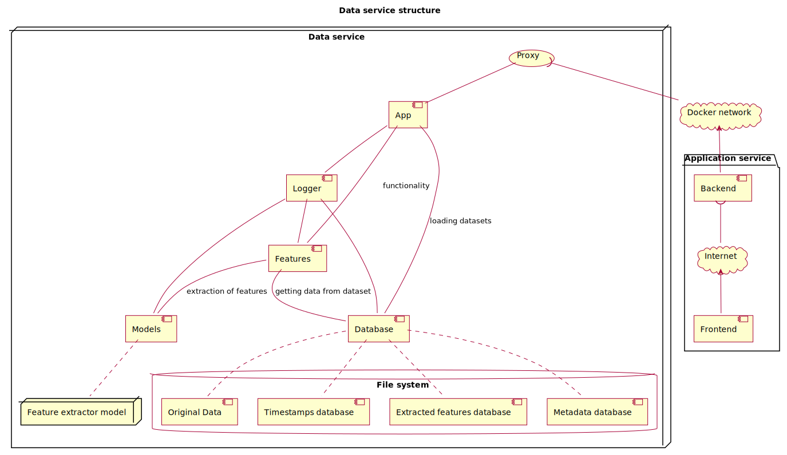
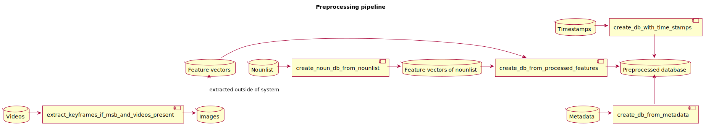

# PraK - the data service

[](LICENSE)
[](https://github.com/merowech/vbs-backend/stargazers)
[](https://github.com/merowech/vbs-backend/issues)

## Overview

This repository contains the data service for the PraK tool, which is an interactive search tool designed to allow users to search in video collections. The tool is designed for the Video Browser Showdown (VBS) and Lifelog Search Challenge (LSC), which evaluate the state-of-the-art interactive video retrieval systems. The backend provides a REST API that allows users to search for video content using text, image, temporal queries, and others. The API is built using FastAPI and Uvicorn and is designed to be scalable and efficient.

The VBS is an international video content search competition that evaluates state-of-the-art interactive video retrieval systems. It has been performed annually as a special event at the International Conference on MultiMedia Modeling (MMM) since 2012. It aims at pushing research on large-scale video retrieval systems that are effective, fast, and easy to use for content search scenarios that are truly relevant in practice (e.g., known-item search in an ever-increasing video archive, as nowadays ubiquitous in many domains of our digital world).

The VBS usually consists of an expert session and a novice session. In the expert session, the developers of the systems themselves try to solve different types of content search queries that are issued in an ad-hoc manner. Although the dataset itself is available to the researchers several months before the actual competition, the queries are unknown in advance and issued on-site. In the novice session volunteers from the MMM conference audience (without help from the experts) are required to solve another set of tasks. This should ensure that the interactive video retrieval tools do not only improve in terms of retrieval performance but also in terms of usage (i.e., ease-of-use).

There are different types of queries:

- **Known-Item Search (KIS):** a single video clip (20 seconds long) is randomly selected from the dataset and visually presented with the projector on-site. The participants need to find exactly the single instance presented. Another task variation of this kind is textual KIS, where instead of a visual presentation, the searched segment is described only by text given by the moderator (and presented as text via the projector).
- **Ad-hoc Video Search (AVS):** here, a rather general description of many shots is presented by the moderator (e.g., „Find all shots showing cars in front of trees“) and the participants need to find as many correct examples (instances) according to the description.
- **Question-Answering (QA):** the participants need to answer a question about the content of the video dataset. The questions are usually of the form „Which color has the object in the video, which was shown?“ or „What was written on the sign in the video?“.

Each query has a time limit (e.g., 5-7 minutes) and is rewarded on success with a score that depends on several factors: the required search time, the number of false submissions (which are penalized), and the number of different instances found for AVS tasks. For the latter case, it is also considered, how many different ranges‚ were submitted for AVS tasks. For example, many different but temporally close shots in the same video count much less than several different shots from different videos.

The LSC is a competition that evaluates the effectiveness of lifelog search systems. Lifelogging is the process of tracking and recording data about one's life. It is usually done using wearable devices, such as cameras, microphones, and other sensors. The goal of lifelogging is to capture and store data about one's daily activities, such as the places visited, the people met, the food eaten, and the activities performed. Lifelogging data can be used for various purposes, such as memory augmentation, health monitoring, and behavior analysis. In the LSC competition, participants are required to develop systems that can search and retrieve information from lifelogging data effectively and efficiently. This competition has used a dataset, which contains a collection of lifelogging videos recorded by one person over a period of one and a half years. The competition otherwise follows the same rules as VBS and contains the same types of queries (KIS, AVS, QA).

## Table of Contents

- [PraK - the data service](#prak---the-data-service)
  - [Overview](#overview)
  - [Table of Contents](#table-of-contents)
  - [Project Structure](#project-structure)
  - [Endpoints](#endpoints)
  - [Prerequisites](#prerequisites)
  - [Installation](#installation)
    - [Setting up the Environment](#setting-up-the-environment)
  - [API Documentation](#api-documentation)
    - [Text Query](#text-query)
    - [Image Query](#image-query)
    - [Image Query by ID](#image-query-by-id)
    - [Get Video Image](#get-video-image)
    - [Temporal Query](#temporal-query)
    - [Filter](#filter)
  - [Running Tests](#running-tests)
  - [Possible Datasets](#possible-datasets)
  - [Current Models](#current-models)
  - [License](#license)
  - [Reference](#reference)

## Project Structure
The project is separated into two main parts: the `server` folder and the `scripts` folder. The `server` folder contains the FastAPI application that serves the REST API, while the `scripts` folder contains the scripts that are used to preprocess the data and extract the features. The `server` folder contains the following files:

- `app.py`: The main FastAPI application that serves the REST API. It contains [the endpoints](#endpoints) for the different types of queries.
- `config.py`: The configuration file that contains the settings for the FastAPI application and the default parameters for the queries.
- `models.py`: The CLIP models that are used by the data service. The models are loaded from the `model` folder if needed. The models are used for feature extraction and similarity calculation.
- `database.py`: The loading of the data from preprocessed files and the creation of the so-called database. The database is used to store the metadata, features, and other information about the dataset. All the data is loaded into memory for fast access.
- `features.py`: The main functionality of the data service, which includes the similarity calculation, filtering, and other operations on the data.
- `logger.py`: The logger configuration that is used by the data service to log information about the requests and responses to the output.
- `start.sh`: The shell script that is used to start the FastAPI application.

Each script in the `server` folder is used to handle a specific part of the data service, so they basically create different components of the data service that ares are connected between each other as can be seen in the diagram below.



The `scripts` folder contains the scripts that are used to preprocess the data and extract the features. The `scripts` folder contains the following files:

- `preprocess.bash`: The bash script that is used to preprocess the data and extract the features. It's a pipeline that is used to create the database from the metadata, extract the features from the videos, and create the hdf5 file containing the feature vectors of noun from the nounlist.
- `create_db_from_metadata.py`: The Python script that is used to create the database from the metadata, which contains the information about the frames. The metadata is stored in a CSV file. The script reads the metadata file and creates the database connected to the IDs of the frames.
- `create_db_from_processed_features.py`: The Python script that is used to create the main database from the processed features. The processed features are stored in an HDF5 file. The script reads the features file and creates the database containing the IDs of the frames and their features.
- `create_db_with_time_stamps.py`: The Python script that is used to create the database with time stamps. The time stamps are stored in a TSV file. The script reads the TSV files and creates the database that connects the IDs of the frames with their time stamps.
- `create_noun_db_from_nounlist.py`: The Python script that is used to create the database of feature vectors from the nounlist using the selected CLIP model. The nounlist is stored in a text file. The script reads the nounlist file and creates the database containing the feature vectors of the nouns.
- `extract_keyframes_if_msb_and_videos_present.py`: The Python script that is used to extract keyframes if the `msb ` folder and videos are present. The keyframes are extracted from the videos and stored in an `image` folder. The script reads the videos and extracts the keyframes from them using the FFmpeg library.
- `keyframes_renamer_to_match_features.py`: The Python script that is used to rename keyframes to match the features. The keyframes are renamed to match the features that are stored in the HDF5 file. The script reads the keyframes and renames them to match the features.

These scripts create a pipeline that is used to preprocess the data and extract the features. At the start of the pipeline, there are metadata, timestamps, videos, feature vectors and nounlist (except of feature vectors everything can be missing). The pipeline is used to first create the hdf5 file with the feature vectors of the nouns from the nounlist, then create the main database from extract the features of each video connected to their IDS, create the database with the time stamps, create the database with metadata and finally extract images from videos if `msb` folder is present. The pipeline is used to create the database that is used by the data service to serve the REST API.



After the data is preprocessed and the features are extracted, the FastAPI application is started using the `start.sh` script. The server part then load all available datasets with their metadata into class [`memory_data_storage`](https://github.com/zuzavop/vbs-backend/blob/lsc2024/server/database.py#L31). The class is used to store all the data in memory and provide fast access to the data. If some additional type of metadata want to be added, the class should be updated to reflect the changes in all script that are used to preprocess the data and `models.py` file. Apropriate Python script should be created to add the new type of metadata to the database and `scripts/preprocess.bash` should be updated to reflect the changes.

## Endpoints

The API has several endpoints that allow users to search for video content using different types of queries. The API is designed to be easy to use and efficient, and it provides a simple interface for searching video content. The supported endpoints are as follows:

/textQuery/  
/imageQuery/  
/imageQueryByID/  
/getVideoImages/
/temporalQuery/
/filter/

The more specific details about the endpoints and their usage are provided in the API documentation section below.

## Prerequisites

- **Python**: Python 3.7+ is required.

- **Nginx** (for general route handling)

- **FastAPI & Uvicorn** (for request handling)

- **Pillow** (for image processing)

- **NumPy & pandas** (for data manipulation)

- **OpenAI GPT-3 & CLIP** (install as per their documentation)

- **python-multipart** (for handling multipart/form-data requests in FastAPI)

- **Transformers** (for natural language processing)

- **h5py** (for working with HDF5 data)

- **SciPy** (for scientific and technical computing)

- **Dill** (for object serialization)

- **PyTorch** (for deep learning)

- **orjson** (for fast JSON serialization)

Ensure Python is installed, create a virtual environment if needed, and install all the required packages that are listed in the `requirements.txt` file.


## Installation

Step-by-step instructions on how to install and run your server.

```bash
# Clone the repository
git clone https://github.com/merowech/vbs-backend.git

# Change directory
cd vbs-backend

# Use docker-compose
docker-compose up --build
```

If new model like `ViT-SO400M-14-SigLIP-384` will be used, you need to download it first and add it to the `model` folder.

### Setting up the Environment

Set $DATA_PATH to the path where the data is stored. Create a folder for each dataset and add the data to it. Each type of data needs to be stored in a separate folder and named properly. The data should be stored in the following structure:

```
$DATA_PATH
│
└───name_of_dataset
│   └───features-version_of_clip.tar.gz
│   └───msb.tar.gz
│   └───metadata.csv
│   └───nounlist.txt

```

The `features-version_of_clip.tar.gz` file contains the features extracted from the dataset using the CLIP model. The `msb.tar.gz` file contains the timestamps of the dataset. The `metadata.csv` file contains the metadata of the dataset. The `nounlist.txt` file contains the list of nouns in the dataset that will be automatically extracted. If another metadata file type is used appropriate Python script should be created to add the metadata to the database and `scripts/preprocess.bash` should be updated to reflect the changes.


## API Documentation

In general, there are several default parameters available for every query:  
Defaults: `{"k": 1000, "dataset": "MVK", "model": "clip-vit-so400m", "max_labels": 10, "add_features": 0, "speed_up": 1}`  
`"add_features"` adds features to the returning json depending on the `"dataset"` and `"model"`.  
`"speed_up"` enables a download of the json file which speeds up the whole process. 
`"max_labels"` sets the maximum number of labels that can be returned. 

### Text Query

**Endpoint:** `/textQuery/`

**Method:** POST

**Description:** Accepts a JSON object with a text query and optional parameters. It retrieves a list of images based on the similarity to the text query.   

**Request Body Example:**
```json
{
  "query": "Your Text Query Here",
  "k": 5,
  "dataset": "Dataset Name",
  "model": "Model Name",
  "add_features": false,
  "speed_up": true,
  "filter": { "weekday": "Monday", "hour": "12-15" },
}
```
  
See `tests\test_textQuery.sh` for an example.

**Response Example:**
```json
[
  {
    "uri": "image_uri",
    "rank": 1,
    "score": 0.95,
    "id": ["video_id", "frame_id"],
    "features": [0.1, 0.2, 0.3],
    "label": [5, 10, 2, 3, 1],
    "time": ["id", 1450.0, 1350.0, 1550.0],
  },
  {
    "uri": "another_image_uri",
    "rank": 2,
    "score": 0.92,
    "id": ["video_id", "frame_id"],
    "features": [0.2, 0.3, 0.4],
    "label": [7, 4, 3, 9, 10],
    "time": ["id", 1450.0, 1350.0, 1550.0],
  }
]
```

### Image Query

**Endpoint:** `/imageQuery/`

**Method:** POST

**Description:** Accepts an image file upload and optional parameters. It retrieves a list of images based on the similarity to the uploaded image query.

**Request Example:**

See `tests\test_imageQuery.sh` for an example.

**Response Example:**
```json
[
  {
    "uri": "image_uri",
    "rank": 1,
    "score": 0.95,
    "id": ["video_id", "frame_id"],
    "features": [0.1, 0.2, 0.3],
    "label": [5, 10, 2, 3, 1],
    "time": ["id", 1450.0, 1350.0, 1550.0],
  },
  {
    "uri": "another_image_uri",
    "rank": 2,
    "score": 0.92,
    "id": ["video_id", "frame_id"],
    "features": [0.2, 0.3, 0.4],
    "label": [7, 4, 3, 9, 10],
    "time": ["id", 1450.0, 1350.0, 1550.0],
  }
]
```

### Image Query by ID

**Endpoint:** `/imageQueryByID/`

**Method:** POST

**Description:** Accepts an image ID and optional parameters. It retrieves a list of images based on the similarity to the provided image ID.

**Request Example:**
```json
{
  "image_id": "YourImageIDHere",
  "k": 5,
  "dataset": "Dataset Name",
  "model": "Model Name",
  "add_features": false,
  "speed_up": true,
  "filter": { "weekday": "Monday", "hour": "12-15" },
}
```

**Response Example:**
```json
[
  {
    "uri": "image_uri",
    "rank": 1,
    "score": 0.95,
    "id": ["video_id", "frame_id"],
    "features": [0.1, 0.2, 0.3],
    "label": [5, 10, 2, 3, 1],
    "time": ["id", 1450.0, 1350.0, 1550.0],
  },
  {
    "uri": "another_image_uri",
    "rank": 2,
    "score": 0.92,
    "id": ["video_id", "frame_id"],
    "features": [0.2, 0.3, 0.4],
    "label": [7, 4, 3, 9, 10],
    "time": ["id", 1450.0, 1350.0, 1550.0],
  }
]
```

### Get Video Image

**Endpoint:** `/getVideoFrames`

**Method:** GET

**Description:** Accepts a video ID and frame ID or item ID (`{video_id}_{frame_id}`) as parameters. It retrieves a specific video image based on the provided IDs.

**Request Example:**
See `tests\test_getVideoImage.sh` for an example.

**Response Example:**
```json
{
  "video_id": "YourVideoIDHere",
  "frame_id": "YourFrameIDHere",
  "video_image": "image_data_here"
}
```

```json
{
  "item_id": "YourItemIDHere",
  "video_image": "image_data_here"
}
```

### Temporal Query

**Endpoint:** `/temporalQuery/`

**Method:** POST

**Description:** Accepts a JSON object with a temporal query and optional parameters. It retrieves a list of images based on the temporal query.

**Request Body Example:**
```json
{
  "query": "Your First Part of Text Query Here",
  "query2": "Your Second Part od Text Query Here",
  "k": 5,
  "dataset": "Dataset Name",
  "model": "Model Name",
  "add_features": false,
  "speed_up": true,
  "filter": { "weekday": "Monday", "hour": "12-15" },
}
```

**Response Example:**
```json
[
  {
    "uri": "image_uri",
    "rank": 1,
    "score": 0.95,
    "id": ["video_id", "frame_id"],
    "features": [0.1, 0.2, 0.3],
    "label": [5, 10, 2, 3, 1],
    "time": ["id", 1450.0, 1350.0, 1550.0],
  },
  {
    "uri": "another_image_uri",
    "rank": 2,
    "score": 0.92,
    "id": ["video_id", "frame_id"],
    "features": [0.2, 0.3, 0.4],
    "label": [7, 4, 3, 9, 10],
    "time": ["id", 1450.0, 1350.0, 1550.0],
  }
]
```

### Filter

**Endpoint:** `/filter/`

**Method:** POST

**Description:** Accepts a JSON object with a list of filters and optional parameters. It retrieves a list of images based on the provided filters.

**Request Body Example:**
```json
{
  "filter": { "weekday": "Monday", "hour": "12-15" },
  "k": 5,
  "dataset": "Dataset Name",
  "model": "Model Name",
  "add_features": false,
  "speed_up": true,
}
```

**Response Example:**
```json
[
  {
    "uri": "image_uri",
    "rank": 1,
    "score": 0,
    "id": ["video_id", "frame_id"],
    "features": [0.1, 0.2, 0.3],
    "label": [5, 10, 2, 3, 1],
    "time": ["id", 1450.0, 1350.0, 1550.0],
  },
  {
    "uri": "another_image_uri",
    "rank": 2,
    "score": 0,
    "id": ["video_id", "frame_id"],
    "features": [0.2, 0.3, 0.4],
    "label": [7, 4, 3, 9, 10],
    "time": ["id", 1450.0, 1350.0, 1550.0],
  }
]
```


## Running Tests

You can run tests for your REST API server using shell scripts located in the `test` directory. Follow these steps to execute the tests:

```bash
# Change directory to the 'tests' folder
cd tests

# Run the tests using the shell script
./test_textQuery.sh
```

Ensure that you have set up any necessary test data or configurations before running the tests.

## Possible Datasets

Currently supported datasets for the VBS challenge:

 - V3C (https://zenodo.org/records/8188570)
 - MVK (https://zenodo.org/records/8355037)
 - VBSLHE (https://zenodo.org/records/10013329)
 - LSC (http://lifelogsearch.org/lsc/lsc_data/)

## Current Models

Currently supported models for the PraK tool:

 - `clip-vit-so400m` ([ViT-SO400M-14-SigLIP-384](https://huggingface.co/timm/ViT-SO400M-14-SigLIP-384))
 - `clip-laion` ([hf-hub:laion/CLIP-ViT-H-14-laion2B-s32B-b79K](https://huggingface.co/laion/CLIP-ViT-H-14-laion2B-s32B-b79K))
 - `clip-openai` ([openai/clip-vit-large-patch14](https://huggingface.co/openai/clip-vit-large-patch14))
 - `clip-vit-webli` ([hf-hub:timm/ViT-L-16-SigLIP-384](https://huggingface.co/timm/ViT-L-16-SigLIP-384))

If you want to use a different model, you need to download it first and add it to the `model` folder and then add the model to the `models.py` file and for the preprocessing, you need to add the model to the `create_noun_db_from_nounlist.py` script and `preprocess.bash` script.

## License
This project is licensed under the MIT License - see the LICENSE file for details.

## Reference

```
@Article{lokoc_prak_2024,
  author  = {Jakub Loko\v{c} and Zuzana Vopálková and Michael Stroh and Raphael Buchmueller and Udo Schlegel},
  journal = {VBS 2024 at MMM 2024},
  title   = {{PraK Tool: An Interactive Search Tool Based on Video Data Services}},
  year    = {2024},
}
```

```
@inproceedings{vopalkova2024searching,
  title={Searching temporally distant activities in lifelog data with prak tool V2},
  author={Vop{\'a}lkov{\'a}, Zuzana and Yaghob, Jakub and Stroh, Michael and Schlegel, Udo and Lokoc, Jakub},
  booktitle={Proceedings of the 7th Annual ACM Workshop on the Lifelog Search Challenge},
  pages={111--116},
  year={2024}
}
```

```
@inproceedings{stroh2025prak,
  title={PraK Tool V3: Enhancing Video Item Search Using Localized Text and Texture Queries},
  author={Stroh, Michael and Kloda, Vojt{\v{e}}ch and Verner, Benjamin and Vop{\'a}lkov{\'a}, Zuzana and Buchm{\"u}ller, Raphael and J{\"a}ckl, Bastian and Hajko, Jakub and Loko{\v{c}}, Jakub},
  booktitle={International Conference on Multimedia Modeling},
  pages={326--333},
  year={2025},
  organization={Springer}
}
```
